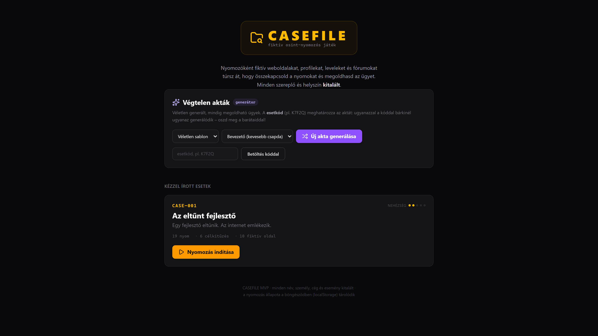
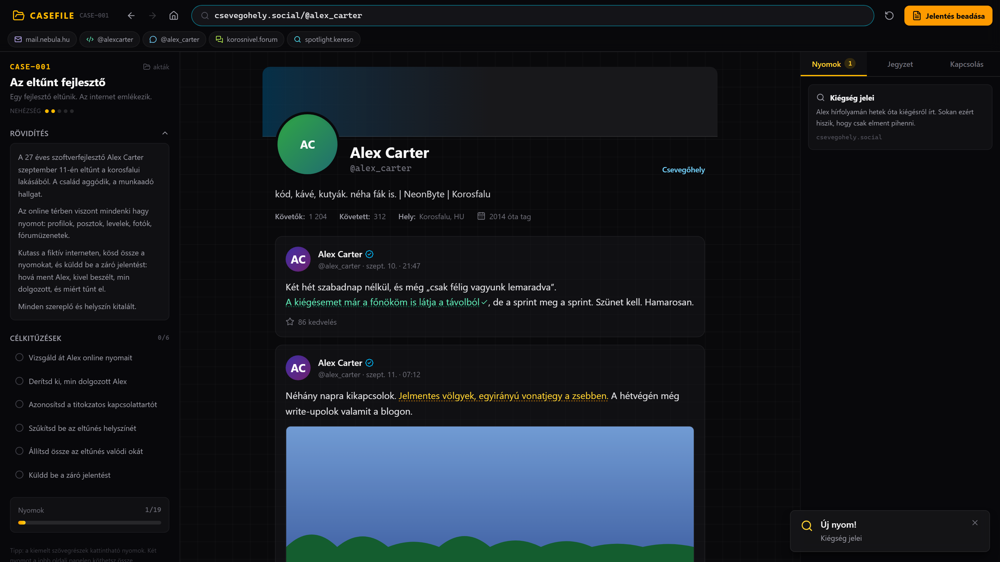

# CASEFILE

### Fiktív OSINT-nyomozós játék a böngésződben

Túrd át a fiktív internetet – profilekat, leveleket, fórumokat, térképet –,
kösd össze a nyomokat, és oldd meg az ügyet.

**[▶ Játék indítása](https://nyuszko.github.io/osint_game/)** · [Fejlesztői dokumentáció](DEVELOPMENT.md)

## Hogyan működik?

1. **Válassz aktát** – játszd végig a kézzel írott eseteket, vagy generálj végtelen sok véletlen ügyet.
2. **Kutass a fiktív neten** – kereső, közösségi feed, fórum, webmail, képgaléria, hírportál, cégoldal, blog és interaktív térkép: mindegyik kattintható **nyomokat** rejt.
3. **Kössd össze a nyomokat** – két megtalált nyom párosításából **következtetések** születnek, és automatikusan teljesülnek a célkitűzések.
4. **Add be a záró jelentést** – 4 kérdés, de a helyes válaszok csak a megtalált nyomokkal nyílnak fel. 3 hibás beküldés = bukta. Siker esetén pontszám és nyomozói rang (**S / A / B / C**).

## Funkciók

- **Hamis internet** – 10+féle kattintható fiktív oldal (kereső, feed, chat/üzenetek, fórum, webmail, galéria, hírek, cég, blog, térkép) rejtett nyomokkal; minden „fotó" determinisztikusan generált SVG, nincs külső kérés.
- **Végtelen akták** – a generátor determinisztikus: ugyanaz az **esetkód** (pl. `K7F2Q`) mindig ugyanazt az aktát adja, így megoszthatod a barátaiddal.
- **Négy sablon és öt nehézség** – eltűnt személy, pénzügyi csalás, hamis identitás, vezetői levél csalás (BEC); a „teli zaj" szinten rengeteg tévút.
- **Napi akta** – minden nap mindenkinél ugyanaz az ügy; az eredmény megosztható.
- **Nyompanel + jegyzet + tippek** – a nyomok, összefüggések és jegyzeteid mindig kéznél vannak; elakadásnál kérhetsz tippet (pontlevonással).
- **Rang és pontszám** – a teljesítményed nyomozói rangra (S/A/B/C) fordul le, a statisztikáid pedig a menüben követhetők.
- **Akta-műhely** – meglévő akta átszövegezése saját aktaként, valamint JSON import/export a megosztáshoz.
- **Automatikus mentés, offline, telepíthető** – a haladás a böngésző localStorage-ában van, a játék teljesen offline fut (PWA).

## Futtatás

A játék egy statikus oldal – élesben semmilyen telepítés nem kell, elég a [GitHub Pages link](https://nyuszko.github.io/osint_game/).

Fejlesztőkhöz a részletes útmutató (futtatás, tesztek, tartalom-bővítés, publikálás): **[DEVELOPMENT.md](DEVELOPMENT.md)**

## Fontos

> Minden szereplő, cég, helyszín és esemény **kitalált**. A játék valós személyekről vagy szervezetekről nem gyűjt adatot – tisztán fikciós, oktatási szórakoztató projekt.

## Technológia

Vite · React 19 · TypeScript · Tailwind CSS v4 · Zustand · saját seed-alapú procedurális generátor beépített megoldhatóság-validátorral
